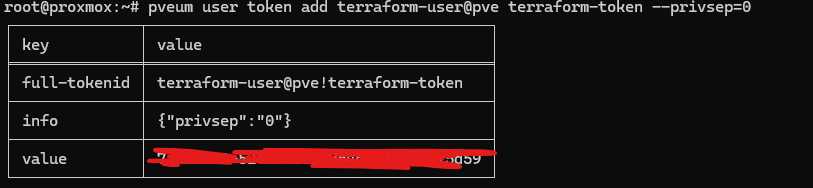

# Summary

Guide to setup user and api token for proxmox pver using guide snippets from [here][def]

# Steps

```shell
# Create a new role for the future terraform user.
pveum role add TerraformProv -privs "Datastore.AllocateSpace Datastore.Audit Pool.Allocate Sys.Audit Sys.Console Sys.Modify VM.Allocate VM.Audit VM.Clone VM.Config.CDROM VM.Config.Cloudinit VM.Config.CPU VM.Config.Disk VM.Config.HWType VM.Config.Memory VM.Config.Network VM.Config.Options VM.Migrate VM.Monitor VM.PowerMgmt SDN.Use"

# Create the user "terraform-user@pve"
pveum user add terraform-user@pve --password <password>

# Add the terraform-user role to the terraform-user user
pveum aclmod / -user terraform-user@pve -role TerraformProv

```

```
# Add a token to user which returns token on screen!
pveum user token add terraform-user@pve terraform-token --privsep=0
```


```
terraform-user@pve!terraform-token
7a4f5fa0-52f1-41e1-9c4e-53eac9b25d59 
```

## Modifu privelages


```shell
pveum role modify TerraformProv -privs "Datastore.AllocateSpace Datastore.Audit Pool.Allocate Sys.Audit Sys.Console Sys.Modify VM.Allocate VM.Audit VM.Clone VM.Config.CDROM VM.Config.Cloudinit VM.Config.CPU VM.Config.Disk VM.Config.HWType VM.Config.Memory VM.Config.Network VM.Config.Options VM.Migrate VM.Monitor VM.PowerMgmt SDN.Use"
```

[def]: https://registry.terraform.io/providers/Terraform-for-Proxmox/proxmox/latest/docs#creating-the-proxmox-user-and-role-for-terraform