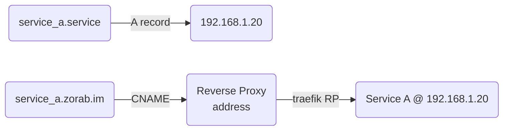

# Summary

Steps on how to configure and onboard a new service into a site once up and running. 

## Steps

1. Add to  [homepage](../homepage)
2. DNS 
    1. Add A record entry on [Pi Hole](../DNS/README.md) for the local .service / .server  
      eg: myservice.**service** OR myhost.**server** -> DNS of server hosting it. 
    2. Add a CNAME record on pihole to same service with .zorab.im at the end.  
      eg: myservice.zorab.im -> dockerhost01
3. Configure [Traefik](../traefik/README.md) labels so it can get SSL and can be reverse proxied

## Map

