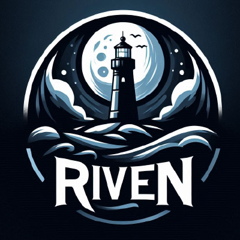

# Summary

> Riven is a powerful media management and streaming solution designed to integrate with various media servers and third-party services. It automates the process of finding, downloading, and organizing media content, making it instantly available for streaming through your preferred media server.

<!-- Located at https://homepage.zorab.im/ -->

## Configuration 

| Host           | Install | Config         |
| -------------- | ------- | -------------- |
| frontend.server | docker  | docker compose |

[Docker compose](../../docker_compose/riven/compose.yml)

<!-- Config location: /home/daniel/docker/homepage/services.yaml -->

* [ ] docker
* [ ] docker env variables
* [ ] docker volumes
    * [ ] folder bind mounts
    * [ ] native docker volume
    * [ ] side car software
* [ ] Open API

<!-- ## Steps

Edit the service.yaml file and then watch it reload on the fly. -->

### LInks

[Riven Wiki](https://rivenmedia.github.io/wiki/)
[Riven github](https://github.com/rivenmedia/riven)
